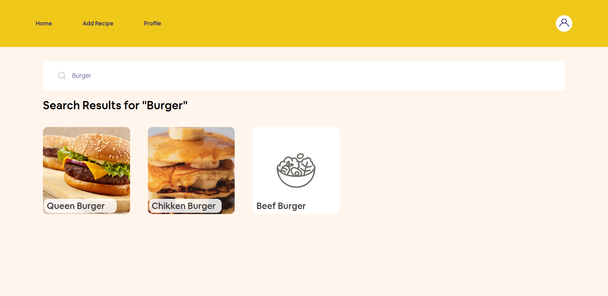

  

  <h1 align="center">Mama Recipe</h1>

  

    Food Recipe Implementation
     
     
    <a href="https://mama-recipe-food.vercel.app/" target="_blank">View Demo</a>
    ·
    <a href="#" target="_blank" disabled>View Back-End Repo</a>
  

  
Table of Contents

  <ul>
    <li>
      <a href="#about-the-project">About The Project</a>
      <ul>
        <li><a href="#built-with">Built With</a></li>
      </ul>
    </li>
    <li><a href="#usage">Usage</a></li>
    <li><a href="#documentation">Documentation</a></li>
    <li><a href="#domain-to-visit-pages">Domain to Visit Pages</a></li>
    <li><a href="#reference">Reference</a></li>
  </ul>

## About The Project

My web-based application, **Mama Recipe**, is specifically designed for food enthusiasts who are always seeking new inspirations in the kitchen. With a constantly updated collection of recipes from around the world, you can discover a wide range of dishes, from traditional cuisine to modern creations. Interactive features such as video tutorials, automatic shopping lists, and an online chef community make your cooking experience more enjoyable and easy. So, what are you waiting for? Explore **Mama Recipe** now and find your new favorite recipes!

### Built With

[![Next][Next.js]][Next-url]
[![React][React.js]][React-url]
[![Tailwind][Tailwind]][Tailwind-url]
[![Redux][Redux]][Redux-url]

## Usage

This application is a portfolio that inspired from this [Figma template](https://www.figma.com/design/SUbBTYCq1e4ngRt20lSdqr/Food-Recipe?node-id=47-1273&t=zKQHFrZI17X3NJUQ-0). The programming used in this application is Next.js with React components utilizing router pages. Additionally, I used Tailwind as CSS Framework, with enhancements such as CLSX and ESLint to improve efficiency and maintain code consistency. I also used Axios for API calls, while date-fns and js-cookie manage date handling and cookies. For developing my authentication and other validations, I used Yup for schema validation. Lastly, Redux is implemented for state management, completing the overall project of this application.

## Documentation

Here are the pages that I am working on:

1. Login Page

   

      
Show Image

      
   

2. Register Page

   

3. Home Page

   

4. Search Page

   

5. Detail Recipe Page

   

6. Add Recipe Page

   

7. Profile Page

   

## Domain to Visit Pages

If you wish to view my website, please click the link provided below. Thank you very much for your interest and appreciation.

[Click Here](https://mama-recipe-food.vercel.app/)

## Reference

Feel free to check it out:

[Node.js](https://nodejs.org/en)

[Axios](https://axios-http.com/docs/intro)

[React Dom Router](https://reactrouter.com/en/main)

[js-cookie](https://github.com/js-cookie/js-cookie)

[date-fns](https://date-fns.org/)

[clsx](https://www.npmjs.com/package/clsx)

[Vercel as Deployment](https://vercel.com/)

[Img Shields](https://shields.io)

[Next.js]: https://img.shields.io/badge/next.js-000000?style=for-the-badge&logo=nextdotjs&logoColor=white
[Next-url]: https://nextjs.org/
[React.js]: https://img.shields.io/badge/React-20232A?style=for-the-badge&logo=react&logoColor=white
[React-url]: https://reactjs.org/
[Tailwind]: https://img.shields.io/badge/tailwindcss-38B2AC?style=for-the-badge&logo=tailwind-css&logoColor=white
[Tailwind-url]: https://tailwindcss.com/
[Redux]: https://img.shields.io/badge/redux-764ABC?style=for-the-badge&logo=redux&logoColor=white
[Redux-url]: https://redux.js.org/
