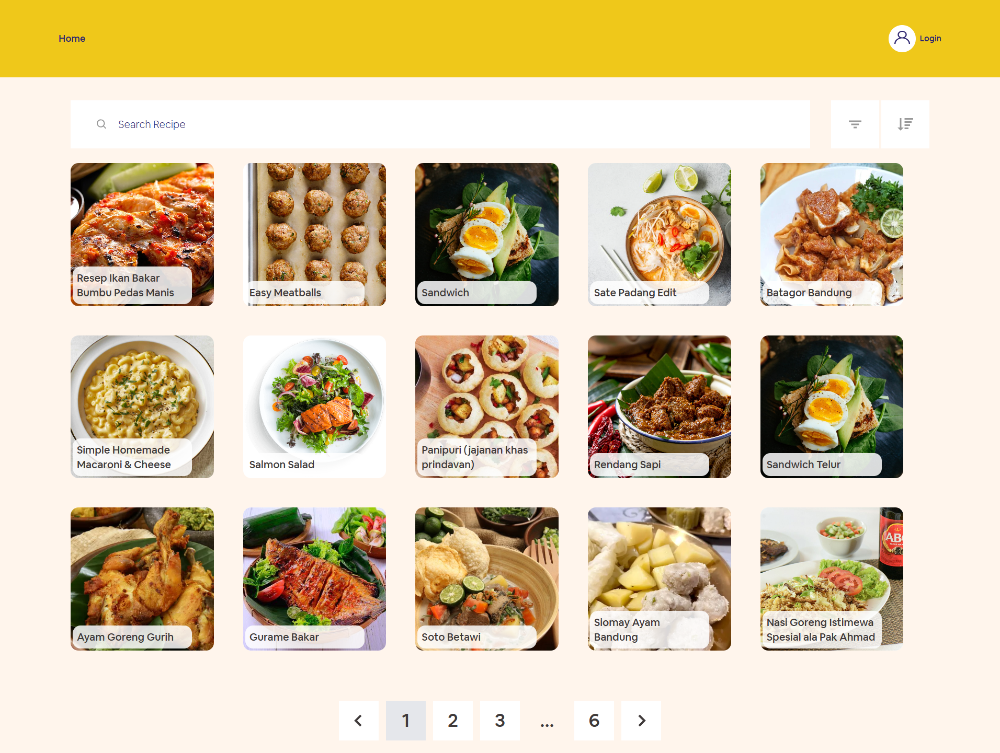

<a name="readme-top"></a>

<div align="center">
  <a href="https://github.com/harbanery/mama-food-recipe-app">
    
  </a>

  <h1 align="center">Mama Recipe</h1>

  <p align="center">
    Food Recipe Implementation
    <br />
    <br />
    <a href="https://mama-recipe-food.vercel.app/" target="_blank">View Demo</a>
    ·
    <a href="https://github.com/harbanery/be-mama-food-recipe-app" target="_blank">View Back-End Repo</a>
  </p>
</div>

<!-- <details>
  <summary>Table of Contents</summary>
  <ul>
    <li>
      <a href="#about-the-project">About The Project</a>
      <ul>
        <li><a href="#built-with">Built With</a></li>
      </ul>
    </li>
    <li>
      <a href="#getting-started">Getting Started</a>
      <ul>
        <li><a href="#prerequisites">Prerequisites</a></li>
        <li><a href="#installation">Installation</a></li>
        <li><a href="#setup-environment-variables">Setup Environment Variables</a></li>
      </ul>
    </li>
    <li><a href="#usage">Usage</a>
    <ul>
        <li><a href="#features">Features</a></li>
        <li><a href="#screenshots">Screenshots</a></li>
      </ul>
    </li>
    <li><a href="#contributing">Contributing</a></li>
    <li><a href="#license">License</a></li>
    <li><a href="#contact">Contact</a></li>
    <li><a href="#acknowledgements">Acknowledgements</a></li>
  </ul>
</details> -->

## Table of Contents

- [Table of Contents](#table-of-contents)
- [About The Project](#about-the-project)
  - [Built With](#built-with)
- [Getting Started](#getting-started)
  - [Prerequisites](#prerequisites)
  - [Installation](#installation)
  - [Setup Environment Variables](#setup-environment-variables)
- [Usage](#usage)
  - [Features](#features)
  - [Screenshots](#screenshots)
- [Contributing](#contributing)
- [License](#license)
- [Contact](#Contact)
- [Acknowledgements](#acknowledgements)

## About The Project

My web-based application, **Mama Recipe**, is specifically designed for food enthusiasts who are always seeking new inspirations in the kitchen. With a constantly updated collection of recipes from around the world, you can discover a wide range of dishes, from traditional cuisine to modern creations. Interactive features such as video tutorials, automatic shopping lists, and an online chef community make your cooking experience more enjoyable and easy. So, what are you waiting for? Explore **Mama Recipe** now and find your new favorite recipes!

### Built With

[![Next][Next.js]][Next-url]
[![React][React.js]][React-url]
[![Tailwind][Tailwind]][Tailwind-url]
[![Redux][Redux]][Redux-url]
[![Node][Node.js]][Node-url]

## Getting Started

To get a local copy up and running follow these simple steps.

### Prerequisites

- npm

  ```sh
    npm install npm@latest -g
  ```

### Installation

1. Clone Repo

   ```sh
     git clone https://github.com/harbanery/mama-food-recipe-app.git
   ```

2. Install NPM packages

   ```sh
     npm install
   ```

### Setup Environment Variables

1. Create a `.env` or `.env.local` file in your local root directory.

2. Add the following variables to the `.env` or `.env.local` file:

   ```sh
     NEXT_PUBLIC_URL=your_api_url
   ```

## Usage

This application is a portfolio inspired by a [Figma template](https://www.figma.com/design/SUbBTYCq1e4ngRt20lSdqr/Food-Recipe?node-id=47-1273&t=zKQHFrZI17X3NJUQ-0).

### Features

- **Utilizing Next.js** with router pages and React components.
- Majority of pages using **SSR** to improve performance and **SEO** by rendering pages on the server.
- **User authentication** and authorization using **JWT**.
- Managing **JWT in cookies** using [js-cookie](https://github.com/js-cookie/js-cookie).
- **Protected routes** for secure access.
- **Create, edit, and delete** user recipes.
- **Browse recipes** with search, sort, and order functionalities.
- **Like and save recipes**.
- **API handling** using [Axios](https://axios-http.com/docs/intro).
- Handling **date functions** with [date-fns](https://date-fns.org/).
- **State management** with Redux for alerts, validation checks (handled by **Yup**), and authentication.
- **Linting** with **ESLint** for maintaining code quality.
- Enhanced CSS with [**clsx**](https://www.npmjs.com/package/clsx) for improved efficiency.

### Screenshots

For more details, feel free to check in show/hide images below.

<details>
  <summary>Show/Hide Images</summary>
  <br>
  <table>
   <tr>
      <th>Login Page</th>
   </tr>
   <tr>
    <td>
      <details>
        <summary>Show/Hide Image</summary>
        <br>
        
      </details>
    </td>
   </tr>
   <tr>
      <th>Register Page</th>
   </tr>
   <tr>
    <td>
      <details>
        <summary>Show/Hide Image</summary>
        <br>
        
      </details>
    </td>
   </tr>
   <tr>
      <th>Home Page</th>
   </tr>
   <tr>
    <td>
      <details>
        <summary>Show/Hide Image</summary>
        <br>
        
      </details>
    </td>
   </tr>
   <tr>
      <th>Browse Page</th>
   </tr>
   <tr>
    <td>
      <details>
        <summary>Show/Hide Image</summary>
        <br>
        
      </details>
    </td>
   </tr>
   <tr>
      <th>Detail Recipe Page</th>
   </tr>
   <tr>
    <td>
      <details>
        <summary>Show/Hide Image</summary>
        <br>
        
      </details>
    </td>
   </tr>
   <tr>
      <th>Add Recipe Page</th>
   </tr>
   <tr>
    <td>
      <details>
        <summary>Show/Hide Image</summary>
        <br>
        
      </details>
    </td>
   </tr>
   <tr>
      <th>Profile Page</th>
   </tr>
   <tr>
    <td>
      <details>
        <summary>Show/Hide Image</summary>
        <br>
        
      </details>
    </td>
   </tr>
</table>
</details>

## Contributing

Contributions are what make the open source community such an amazing place to learn, inspire, and create. Any contributions you make are **greatly appreciated**.

1. Fork the Project
2. Create your Feature Branch (`git checkout -b feature/AmazingFeature`)
3. Commit your Changes (`git commit -m 'Add some AmazingFeature'`)
4. Push to the Branch (`git push origin feature/AmazingFeature`)
5. Open a Pull Request

## License

Distributed under the MIT License. See [`LICENSE`](https://github.com/harbanery/mama-food-recipe-app/blob/main/LICENSE) for more information.

## Contact

If you have any questions or inquiries regarding this project, feel free to contact me at ryusuf05@gmail.com

## Acknowledgements

Feel free to check it out:

- [React Icons](https://react-icons.github.io/react-icons/)
- [Vercel as Deployment](https://vercel.com/)
- [Img Shields](https://shields.io)
- [Choose an Open Source License](https://choosealicense.com/)
- [GitHub Pages](https://pages.github.com/)

<!-- MARKDOWN LINKS & IMAGES -->

[Node.js]: https://img.shields.io/badge/node.js-339933?style=for-the-badge&logo=nodedotjs&logoColor=white
[Node-url]: https://nodejs.org/en
[Next.js]: https://img.shields.io/badge/next.js-000000?style=for-the-badge&logo=nextdotjs&logoColor=white
[Next-url]: https://nextjs.org/
[React.js]: https://img.shields.io/badge/React-20232A?style=for-the-badge&logo=react&logoColor=white
[React-url]: https://reactjs.org/
[Tailwind]: https://img.shields.io/badge/tailwindcss-38B2AC?style=for-the-badge&logo=tailwind-css&logoColor=white
[Tailwind-url]: https://tailwindcss.com/
[Redux]: https://img.shields.io/badge/redux-764ABC?style=for-the-badge&logo=redux&logoColor=white
[Redux-url]: https://redux.js.org/
